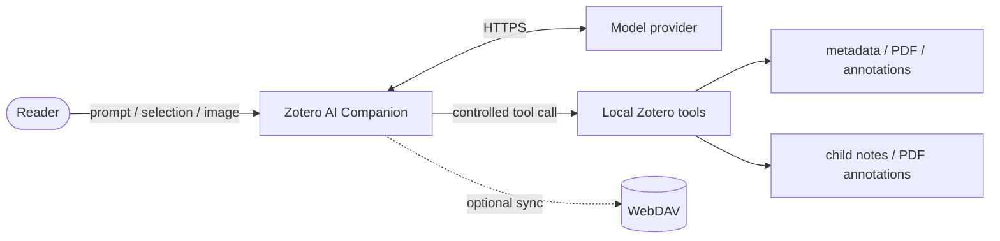

# Zotero AI Companion

[](https://github.com/Dennis-Huangm/zotero-ai-companion/releases/latest)
[](https://github.com/Dennis-Huangm/zotero-ai-companion/actions/workflows/release.yml)
[](docs/ZOTERO_10_COMPATIBILITY.md)
[](LICENSE)

[中文](README.md) · [English](README.en.md)

Bring AI into the Zotero reading workflow instead of moving papers into a separate chat application.

Zotero AI Companion is a paper-aware sidebar for Zotero. It can answer questions about the current paper, inspect PDF content, explain selections, translate paragraphs, analyze images, search the web, and write useful results back to Zotero notes. When you switch papers, it opens the most recently updated conversation for that paper; if none exists, it starts a new one.

## Features

| Feature                    | What it does                                                                                                              |
| -------------------------- | ------------------------------------------------------------------------------------------------------------------------- |
| Paper-aware chat           | Reads item metadata, abstracts, full PDF text, targeted ranges, current selections, and Zotero annotations.               |
| Automatic paper switching  | Restores the latest conversation for the selected paper, or creates a new conversation when no history exists.            |
| Full and point translation | Translates PDFs paragraph by paragraph and reuses cached translations when possible.                                      |
| Conversation history       | Provides a dedicated page for all/current-paper filtering, opening, renaming, and deleting conversations.                 |
| Image input                | Accepts local image files and images pasted from the system clipboard.                                                    |
| Web search                 | The `Web` button directly enables or disables Live web search; valid citations become clickable sources.                  |
| Zotero writes              | Appends answers to child notes and can create PDF highlights, comments, and text annotations when explicitly requested.   |
| Local tools                | Lets the model inspect metadata, search a PDF, read an exact range, read full text, or perform controlled Zotero actions. |
| Sync and backup            | Optionally syncs plugin state through a separate WebDAV configuration and supports JSON backup/restore.                   |
| Multiple providers         | Supports OpenAI, Anthropic, and compatible endpoints implementing the corresponding APIs.                                 |

## Quick Start

### 1. Install

1. Download `zotero-ai-companion.xpi` from the [latest release](https://github.com/Dennis-Huangm/zotero-ai-companion/releases/latest).
2. Open `Tools → Plugins` in Zotero.
3. Click the gear button and choose `Install Plugin From File…`.
4. Select the XPI and restart Zotero when prompted.
5. Open the sidebar settings and add at least one model preset.

If you previously installed the upstream or an early local build, disable or remove these old IDs first:

- `zotero-ai-sidebar@local`
- `zotero-ai-sidebar@huangkiki`

This project uses its own plugin ID:

```text
zotero-ai-companion@dennis-huangm.github.io
```

After the independent build is installed once, later versions can be delivered through this repository's stable update channel.

### 2. Configure a model

A model preset contains:

- `Provider`: OpenAI, Anthropic, or a compatible implementation;
- `API Key`: the credential for that service;
- `Base URL`: the official endpoint or your compatible relay;
- `Model`: a model ID supported by the endpoint;
- `Max tokens`: the output limit for one response;
- `Reasoning`: effort and summary controls for models that support them.

Presets are stored in local Zotero preferences and are never committed to this repository. Do not expose API keys in issues, logs, or screenshots.

### 3. Read and ask

Use the composer directly or start with a quick action:

- `Summarize Paper`: organize the problem, method, experiments, and conclusion;
- `Full-text Key Points`: read the full PDF and extract notable content;
- `Explain Selection`: ask about the text selected in the PDF reader;
- `Full Translate / Retranslate / Point Translate`: translate the paper or a clicked paragraph;
- `Image`: attach a figure, formula, or screenshot from the clipboard;
- `Web`: click once to enable Live web search and again to disable it;
- `+ New Chat`: create another conversation for the current paper.

Example prompts:

```text
Summarize this paper by research question, core method, experiment design,
main results, and limitations.
```

```text
Compare the proposed method with the baseline mentioned in my selection.
Is the evidence sufficient?
```

```text
Turn this discussion into a literature note while preserving verifiable
numbers and limitations.
```

## Conversations and Papers

Conversations are associated with Zotero items. When the selected paper changes, the plugin:

1. opens that paper's most recently updated conversation;
2. creates a new conversation when the paper has no history;
3. ignores stale asynchronous loads when papers are switched quickly;
4. keeps other in-progress paper conversations alive in memory.

Use the top `History` button to open the management page. It can show all conversations or only conversations for the current paper, and supports opening, renaming, and deleting records.

Local history is stored in the Zotero data directory as:

```text
zotero-ai-sidebar-chat-history.json
```

The legacy filename is intentionally preserved so existing history survives migration. Older profile-local history is migrated to the Zotero data directory when first read.

## Web Search, Citations, and Images

`Web` is a direct toggle with no secondary popup. Compatible OpenAI Responses endpoints can use Web Search when it is enabled. Valid `url_citation` annotations are rendered as a Markdown source list, while leaked internal citation markers from compatible relays are removed.

Images can be added by selecting a local file or by taking a screenshot with the operating system and pressing `Ctrl+V` in the composer. The plugin does not provide a separate screenshot button.

## Zotero Tools and Write Safety

The model does not access the Zotero database directly. The plugin exposes a controlled set of local tools, validates their arguments, and performs the actual read or write on the local machine.



The default permission mode is intended for reading and analysis. Mutating actions such as writing notes or creating annotations require an explicit user request; approval-gated write tools only run without per-action approval when YOLO mode is enabled. Verify the current paper and instruction before enabling it.

## Data and Privacy

- API keys, base URLs, and model presets are stored in local Zotero preferences.
- Conversation history is stored in the local Zotero data directory by default.
- Prompts and the paper content needed for a task are sent to the selected model provider.
- When web search is enabled, search queries and sources are handled by the compatible provider.
- Plugin WebDAV sync is optional and separate from Zotero's own library/PDF sync.

Decide whether to send full text or images based on the paper's copyright/confidentiality requirements and the provider's privacy policy.

## Compatibility

- Zotero 7, 8, 9, and 10;
- Windows is the primary maintained and manually tested environment;
- cross-platform paths remain for macOS and Linux, but current verification is Windows-first;
- one XPI supports the full Zotero 7–10 range.

More documentation:

- [Zotero 10 compatibility audit](docs/ZOTERO_10_COMPATIBILITY.md)
- [Windows support](docs/WINDOWS_SUPPORT.md)
- [Tools and MCP](docs/TOOLS_AND_MCP.md)
- [Harness engineering](docs/HARNESS_ENGINEERING.md)

## Development

Node.js 22 or newer and a Zotero installation are recommended.

```bash
npm install
npm test
npm run build
```

The built plugin is written to:

```text
.scaffold/build/zotero-ai-companion.xpi
```

Run the development build:

```bash
npm start
```

Publish a release:

```bash
npm run release:xpi
```

The release script validates the version, runs tests, builds the XPI, creates the matching `v<version>` tag, and waits for GitHub Actions to publish the installer and update manifests. See [docs/RELEASE.md](docs/RELEASE.md) for details.

## Origin

This project continues development from [huangkiki/zotero-ai-sidebar](https://github.com/huangkiki/zotero-ai-sidebar) with an independent plugin ID, repository, and update channel. The upstream repository is retained as a reference and cannot overwrite this project's releases.

Use [GitHub Issues](https://github.com/Dennis-Huangm/zotero-ai-companion/issues) for bug reports and feature requests. Include the Zotero version, plugin version, reproduction steps, and sanitized error details.

## License

[AGPL-3.0-or-later](LICENSE)
