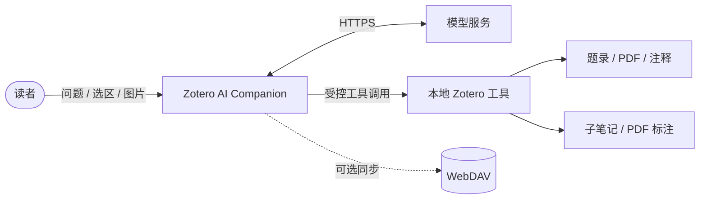

# Zotero AI Companion

[](https://github.com/Dennis-Huangm/zotero-ai-companion/releases/latest)
[](https://github.com/Dennis-Huangm/zotero-ai-companion/actions/workflows/release.yml)
[](docs/ZOTERO_10_COMPATIBILITY.md)
[](LICENSE)

[中文](README.md) · [English](README.en.md)

把 AI 放进 Zotero 的论文阅读流程，而不是把论文搬到另一个聊天窗口。

Zotero AI Companion 是一条面向论文阅读的 Zotero 侧栏。它能围绕当前论文提问、读取 PDF、解释选区、翻译段落、分析图片、联网检索，并把有用结果写回 Zotero 笔记。切换论文时，侧栏会自动切换到该论文最近的会话；没有历史记录时则直接开始新会话。

## 主要功能

| 功能         | 说明                                                                         |
| ------------ | ---------------------------------------------------------------------------- |
| 论文感知对话 | 读取当前条目的标题、作者、摘要、PDF 全文、局部段落、选区和 Zotero 注释。     |
| 自动跟随论文 | 打开或切换论文时恢复该论文最后更新的会话；没有历史时自动新建。               |
| 全文译与点译 | 按段翻译 PDF，并复用已有翻译缓存；点选段落即可查看译文。                     |
| 历史记录     | 独立历史页面支持“全部 / 当前论文”筛选，以及打开、重命名和删除会话。          |
| 图片理解     | 选择本地图片，或在系统截图后直接向输入框粘贴剪贴板图片。                     |
| 联网搜索     | 点击底部“联网”即可直接开启或关闭 Live 联网；有效网页引用会显示为可点击来源。 |
| Zotero 写入  | 将回答追加到当前条目的子笔记，或按明确指令创建 PDF 高亮、评论和文字标注。    |
| 本地工具     | 模型可按需读取题录、搜索 PDF、读取指定范围、读取全文或操作 Zotero 内容。     |
| 同步与备份   | 可通过独立 WebDAV 配置同步插件状态，也支持 JSON 配置备份与恢复。             |
| 多模型端点   | 支持 OpenAI、Anthropic，以及实现相应协议的兼容端点。                         |

## 快速开始

### 1. 安装插件

1. 从 [GitHub Releases](https://github.com/Dennis-Huangm/zotero-ai-companion/releases/latest) 下载 `zotero-ai-companion.xpi`。
2. 在 Zotero 中打开 `工具 → 插件`。
3. 点击齿轮按钮，选择 `从文件安装插件…`。
4. 选择下载的 XPI，并按提示重启 Zotero。
5. 在插件侧栏中打开“设置”，添加至少一个模型预设。

如果安装过原项目或早期本地版，请先禁用或卸载以下旧 ID，避免两套侧栏同时加载：

- `zotero-ai-sidebar@local`
- `zotero-ai-sidebar@huangkiki`

当前插件使用独立 ID：

```text
zotero-ai-companion@dennis-huangm.github.io
```

安装一次独立版本后，后续版本可通过本仓库的固定更新通道自动升级。

### 2. 配置模型

模型预设包含：

- `Provider`：OpenAI、Anthropic 或兼容实现；
- `API Key`：模型服务的访问密钥；
- `Base URL`：官方接口地址或你使用的兼容端点；
- `Model`：该端点实际支持的模型 ID；
- `Max tokens`：单次回答的输出上限；
- `Reasoning`：支持该能力的模型可设置推理强度和摘要模式。

配置会保存在 Zotero 本地偏好中，不会提交到本仓库。请不要在 Issue、日志或截图中公开 API Key。

### 3. 打开论文并开始提问

可以直接输入问题，也可以使用快捷按钮：

- `总结论文`：按问题、方法、实验和结论概览当前论文；
- `全文重点`：读取全文并整理值得关注的内容；
- `解释选区`：围绕当前 PDF 选中文字提问；
- `全文译 / 重译 / 点译`：翻译整篇论文或点击的段落；
- `图片`：附加图表、公式截图或其他图片；
- `联网`：单击开启 Live 联网，再次单击关闭；
- `＋ 新对话`：为当前论文建立另一个独立会话。

示例：

```text
请按“研究问题、核心方法、实验设计、主要结果、局限”总结这篇论文。
```

```text
比较本文方法与选区中提到的基线，并指出作者的证据是否充分。
```

```text
把这轮讨论整理成文献笔记，保留可复查的实验数字和局限。
```

## 会话与当前论文

插件按 Zotero 条目保存会话。切换论文时：

1. 优先打开该论文最后更新的会话；
2. 如果该论文从未建立过会话，则自动打开一个新会话；
3. 快速连续切换论文时，只保留最后一次选择，避免异步读取跳回旧论文；
4. 正在生成的其他论文会话仍保留在内存中，不会因切换而丢失。

点击顶部 `历史记录` 可进入独立管理页面：

- 查看全部会话或仅查看当前论文会话；
- 打开任意历史会话；
- 重命名或删除会话。

本地历史文件位于 Zotero 数据目录：

```text
zotero-ai-sidebar-chat-history.json
```

文件名继续沿用旧名称，是为了迁移时保留已有记录。旧 profile 目录中的历史文件会在首次读取时迁移到 Zotero 数据目录。

## 联网、引用与图片

底部 `联网` 是直接开关，不再弹出二级菜单。开启后，兼容 OpenAI Responses Web Search 的端点可以自行决定是否搜索网页。API 返回有效 `url_citation` 时，插件会在回答末尾生成 Markdown 来源列表；兼容端点泄漏的内部 citation 标记会被自动清理。

`图片` 支持两种方式：

- 点击按钮选择本地图片；
- 使用 Windows 截图工具后，在输入框按 `Ctrl+V` 粘贴。

插件不再提供独立截图按钮，截图由系统完成。

## Zotero 工具与写入安全

模型不会直接访问 Zotero 数据库。插件把受控能力暴露为本地工具，并在本机执行参数校验和实际操作。



默认权限模式适合阅读和分析。创建注释、写入笔记等修改操作需要明确的用户指令；需要绕过逐项审批的写工具只在启用 YOLO 模式后运行。启用前请确认当前论文和指令无误。

## 数据与隐私

- API Key、Base URL 和模型预设保存在本机 Zotero 偏好中；
- 对话历史默认保存在本机 Zotero 数据目录；
- 发起请求时，问题以及模型完成任务所需的论文内容会发送到所选模型服务；
- 开启联网后，搜索请求和网页来源由相应模型服务处理；
- WebDAV 同步是可选功能，与 Zotero 自带的题录/PDF 同步相互独立。

请根据论文的版权、保密要求和所用模型服务的隐私政策决定是否发送全文或图片。

## 兼容性

- Zotero：7、8、9、10；
- 重点运行环境：Windows；
- macOS / Linux：保留跨平台实现，但当前维护和人工验证以 Windows 为主；
- 同一个 XPI 覆盖 Zotero 7–10。

更多说明：

- [Zotero 10 兼容审计](docs/ZOTERO_10_COMPATIBILITY.md)
- [Windows 支持说明](docs/WINDOWS_SUPPORT.md)
- [工具与 MCP](docs/TOOLS_AND_MCP.md)
- [Harness 工程说明](docs/HARNESS_ENGINEERING.md)

## 开发

要求：Node.js 22 或更高版本，以及可用于测试插件的 Zotero 安装。

```bash
npm install
npm test
npm run build
```

构建结果位于：

```text
.scaffold/build/zotero-ai-companion.xpi
```

本地运行：

```bash
npm start
```

发布流程：

```bash
npm run release:xpi
```

发布脚本会校验版本号、运行测试、构建 XPI、创建 `v<version>` 标签，并等待 GitHub Actions 发布安装包和更新清单。详细说明见 [docs/RELEASE.md](docs/RELEASE.md)。

## 项目来源

本项目基于 [huangkiki/zotero-ai-sidebar](https://github.com/huangkiki/zotero-ai-sidebar) 继续开发，现使用独立插件 ID、仓库和更新通道。上游仓库仅作为参考来源，不会自动覆盖本项目的发布版本。

欢迎通过 [Issues](https://github.com/Dennis-Huangm/zotero-ai-companion/issues) 报告问题或提出建议。提交问题时请附上 Zotero 版本、插件版本、操作步骤和经过脱敏的错误信息。

## 许可证

[AGPL-3.0-or-later](LICENSE)
